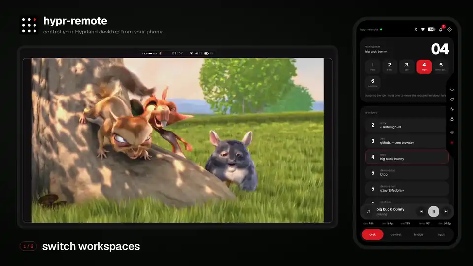
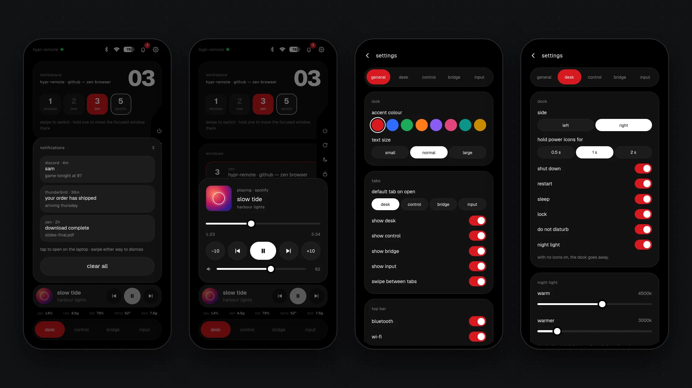

<p align="center">
  
</p>

<h1 align="center">hypr-remote</h1>

<p align="center">Control your Hyprland desktop from your phone over home Wi-Fi.<br />A web page you can install as an app. No app store, no cloud.</p>






## Features

- **Desk**: switch workspaces, focus, move or close windows, and a dock for shut down, restart, sleep, lock, do not disturb and night light.
- **Control**: scenes (movie, focus, night, away, or your own), volume and brightness sliders, mic mute.
- **Bridge**: clipboard both ways (text and images), send links and files to the laptop, grab screenshots and downloads, live screen preview you can click on.
- **Input**: full-screen touchpad, keyboard with the keys phones lack, and a presenter mode with a timer.
- **Everywhere**: a mini media player, system stats, notifications, battery, Wi-Fi and Bluetooth in the header.
- **Settings**: accent colour, text size, which tabs and icons show, and more. Each phone pairs on its own and can be removed on its own.

## Install

You need [Hyprland](https://hyprland.org) and [Bun](https://bun.sh).

1. Clone and install:
   ```bash
   git clone https://github.com/uzayr-iqbal-hamid/hypr-remote.git
   cd hypr-remote
   bun install
   ```
2. Set up typing, clicks, scrolling and external monitor brightness (asks for sudo, works with dnf, pacman, apt and zypper). This also starts hypr-remote at every login:
   ```bash
   scripts/setup-input.sh
   ```
3. Log out and back in once.
4. Show the pairing QR code and scan it with your phone:
   ```bash
   journalctl --user -u hypr-remote
   ```
5. The browser warns about the certificate the first time. Tap **Advanced → Proceed**.
6. Optional: in the remote, open **settings → install as an app**. It walks you through trusting the certificate so the warning goes away.

Skipping step 2? Run `bun run install-service` instead (or `bun start` to run it in the foreground). Everything except typing, clicks and scrolling still works.


The QR code is also saved at `~/.cache/hypr-remote/pair.png`, so you can show it in your own bar or widget.

### Firewall

The phone connects on ports **4000** and **4443**. Fedora Workstation and plain Arch need nothing. Otherwise:

```bash
sudo ufw allow 4000,4443/tcp        # ufw (CachyOS)
sudo firewall-cmd --permanent --add-port=4000/tcp --add-port=4443/tcp && sudo firewall-cmd --reload   # firewalld
```

### Uninstall autostart

```bash
systemctl --user disable --now hypr-remote ydotoold
```

## Requirements

Works on any distro running Hyprland. It won't start under GNOME, KDE, Sway or other compositors.

The core needs `hyprctl`, `playerctl`, PipeWire (`wpctl`, `pactl`), `brightnessctl`, `wl-clipboard`, `grim`, `xdg-open` and `openssl`. A missing optional tool only turns off its own feature:

| Feature                    | Needs                         | Won't work with       |
| -------------------------- | ----------------------------- | --------------------- |
| Notifications, DND         | swaync, mako or dunst         |                       |
| Night light                | hyprsunset                    | gammastep, wlsunset   |
| Lock                       | hyprlock                      | swaylock              |
| Wi-Fi icon                 | NetworkManager (`nmcli`)      | iwd, systemd-networkd |
| Bluetooth icon             | BlueZ (`bluetoothctl`)        |                       |
| Typing                     | wtype                         |                       |
| Clicks, scroll, zoom       | ydotool, `/dev/uinput` access |                       |
| External screen brightness | ddcutil, `/dev/i2c-*` access  |                       |
| Clipboard history          | cliphist                      | clipman               |
| Sleep, restart, shut down  | systemd                       |                       |

<details>
<summary><b>Manual setup</b> (what <code>setup-input.sh</code> does)</summary>

Typing and clicks:

```bash
sudo pacman -S wtype ydotool          # Fedora: sudo dnf install wtype ydotool
groups | grep -q input || sudo usermod -aG input "$USER"
echo 'KERNEL=="uinput", GROUP="input", MODE="0660", OPTIONS+="static_node=uinput"' \
  | sudo tee /etc/udev/rules.d/80-uinput.rules
sudo udevadm control --reload && sudo udevadm trigger
bun run install-service               # adds a ydotoold user service
```

External monitor brightness:

```bash
sudo pacman -S ddcutil                # Fedora: sudo dnf install ddcutil
echo i2c-dev | sudo tee /etc/modules-load.d/i2c-dev.conf && sudo modprobe i2c-dev
getent group i2c || sudo groupadd --system i2c
sudo usermod -aG i2c "$USER"
echo 'KERNEL=="i2c-[0-9]*", GROUP="i2c", MODE="0660"' | sudo tee /etc/udev/rules.d/80-i2c.rules
sudo udevadm control --reload && sudo udevadm trigger
```

Log out and back in afterwards. Some monitors have DDC/CI turned off in their own menu.

> [!NOTE]
> The uinput rule lets any program running as your user inject keystrokes.

</details>

<details>
<summary><b>Configuration</b></summary>

- **Ports**: `PORT` (default 4000) and `HTTPS_PORT` (default 4443).
- **Scenes**: `~/.config/hypr-remote/scenes.json`. Each scene can set `volume`, `brightness`, `dnd`, `nightLight` (2500 to 6500 kelvin, or `false`) and `media` (`"play"` or `"pause"`). Edits apply straight away. You can also edit scenes from the phone.
- **Plain HTTP**: the remote refuses it so nobody on the Wi-Fi can read your token. `HYPR_REMOTE_ALLOW_HTTP=1` allows it anyway.
- **Share sheet**: once installed as an app on Android, share links, text or files to the remote to send them to the laptop.

</details>

<details>
<summary><b>How it works</b></summary>

- `src/server.ts` serves the page, a WebSocket and a few HTTP routes over HTTPS, on the LAN address only. Every route except the page and certificate needs a phone's token.
- `src/devices.ts` stores paired phones as token hashes in `~/.config/hypr-remote/devices.json`.
- `src/actions.ts` lists everything the phone can do, validated with zod. Commands run with a fixed argv and no shell.
- `src/state.ts` reads the desktop: live from Hyprland's event socket, `pactl subscribe` and `playerctl --follow`; the rest is polled only while a phone is connected.
- `public/` is the phone page: plain HTML and JS, no build step. Font: Geist (SIL OFL).

</details>
