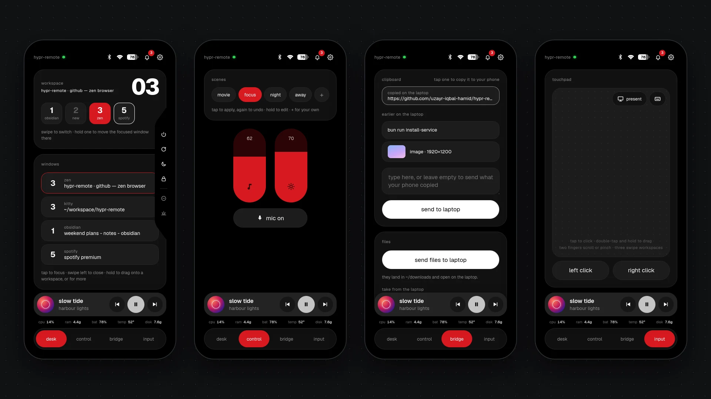
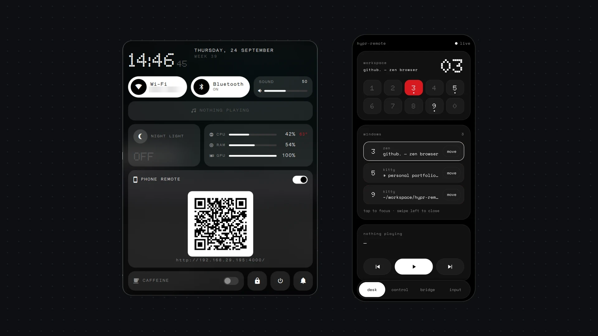
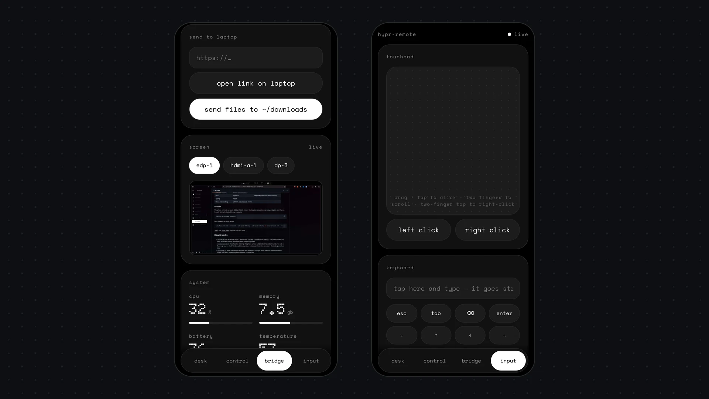

# hypr-remote

Control a Hyprland desktop from your phone over home Wi-Fi. The phone gets a
web page, installable as an app, with four tabs:

- **desk**: Wi-Fi and Bluetooth pills in the header (tap to toggle, hold to
  open the laptop's menu); workspaces in use, each with the app on it (swipe to switch, hold
  one to move the focused window there); the window list (tap to focus, swipe
  left to close, hold to drag onto a workspace or for fullscreen, float and
  force kill); and a dock on the
  right edge to shut down, restart, sleep or lock (hold one until the colour
  spreading from it fills the dock).
- **control**: scenes (tap again to undo, hold to save what's on now); volume
  with speakers, headphones, HDMI or Bluetooth, microphone mute and per-app
  volume; brightness per screen and night light; notifications (tap to open
  the app, swipe to dismiss) and do not disturb for an hour or until
  morning.
- **bridge**: the clipboard both ways, text or images (what the laptop just
  copied shows live, with the last few before it; send takes what the phone
  copied); links open on the laptop; files go to `~/Downloads` and open
  there, and the latest screenshot and downloads come back to the phone; a
  live preview of the screen, which opens full size to zoom in and click.
- While something plays, a mini player floats over the tab bar on every tab
  (tap it for album art, seeking, ±10 seconds and volume). System stats sit
  small just above the tab bar; tap one for its last ten minutes, and for CPU
  and memory the busiest apps (hold one to quit it).
- **input**: a touchpad filling the screen (tap to click, double-tap and
  hold to drag, two fingers to scroll either way or pinch to zoom, three to
  swipe between workspaces), with pointer speed matched to the size of your
  desk; a keyboard over the phone's own, showing what you typed, with the
  keys and shortcuts phones lack; and a full-screen presenter with a clock,
  a timer and the slide, whose "start" picks the key your app needs (never
  a page-reloading F5 in a browser).

It opens on desk; swipe left or right to change tab. Hold a card's title to drag it up or down, or let go for
the option to hide it; tap the title in the header to change the accent
colour. Both are remembered on that phone.



## Run

```bash
bun install
bun run install-service   # start now and at every login (systemd user service)
# or, in the foreground:
bun start
```

Scan the QR code from the terminal (`journalctl --user -u hypr-remote`). It
opens the secure `https://` address, so the pairing token never crosses the
Wi-Fi in the clear. The first time, the browser warns about the certificate:
continue anyway, or install the certificate (see below) so it never asks. To
show the code in your own bar or widget, it is always at
`~/.cache/hypr-remote/pair.png` (and the link at `pair-url`). The phone stays
paired across restarts. Delete `~/.config/hypr-remote/token` to unpair every
phone.



Stop autostart: `systemctl --user disable --now hypr-remote ydotoold`.

### Keyboard, clicks and scrolling

Moving the pointer works out of the box, through Hyprland. Typing needs
`wtype`; clicks and scrolling need `ydotool`, which writes to `/dev/uinput`.
`scripts/setup-input.sh` does all of this with dnf, pacman, apt or zypper,
along with the external screen brightness setup below. By hand:

```bash
sudo pacman -S wtype ydotool          # Arch, CachyOS (Fedora: sudo dnf install wtype ydotool)
groups | grep -q input || sudo usermod -aG input "$USER"   # then log out and back in
echo 'KERNEL=="uinput", GROUP="input", MODE="0660", OPTIONS+="static_node=uinput"' \
  | sudo tee /etc/udev/rules.d/80-uinput.rules
sudo udevadm control --reload && sudo udevadm trigger
bun run install-service   # adds a ydotoold user service
```

The udev rule lets every member of the `input` group create virtual input
devices, which means any program running as your user can inject keystrokes.



### Brightness of external screens

Laptop screens use `brightnessctl`. External monitors are dimmed over DDC/CI,
which needs `ddcutil` and access to `/dev/i2c-*`. `scripts/setup-input.sh`
does this too. By hand:

```bash
sudo pacman -S ddcutil                # Fedora: sudo dnf install ddcutil
echo i2c-dev | sudo tee /etc/modules-load.d/i2c-dev.conf && sudo modprobe i2c-dev
getent group i2c || sudo groupadd --system i2c
sudo usermod -aG i2c "$USER"          # then log out and back in
echo 'KERNEL=="i2c-[0-9]*", GROUP="i2c", MODE="0660"' | sudo tee /etc/udev/rules.d/80-i2c.rules
sudo udevadm control --reload && sudo udevadm trigger
```

Some monitors have DDC/CI turned off in their own menu. Each change takes
about a second to reach the screen, so their sliders apply when you let go.

### Install as an app (HTTPS)

The server makes its own certificate authority in `~/.config/hypr-remote/tls`
and serves HTTPS on 4443. Browsers only install apps once they trust it, so
the "install app" pill in the header walks you through it, with the steps
for your phone ticking off as you go: download the certificate, install it
as a CA certificate, reload, then install from the browser menu. Installed on
Android, the remote shows up in the share sheet: share a link to open it on
the laptop, text to put it on the laptop's clipboard, or files to send them.

Plain HTTP on 4000 only serves the page and the certificate. The remote
itself refuses it, because anyone on the Wi-Fi could read the token and type
on your laptop. If HTTPS can't start (say, no `openssl`), everything falls
back to HTTP with a warning. `HYPR_REMOTE_ALLOW_HTTP=1` allows plain HTTP
anyway.

### Scenes

`~/.config/hypr-remote/scenes.json` is created on first run with movie,
focus, night and away. Each scene can set `volume`, `brightness` (every
screen), `dnd`, `nightLight` (a warmth from 2500 to 6500 kelvin, or `false`)
and `media` (`"play"` or `"pause"`). Changes to the file apply straight away.
Holding a scene on the phone saves the current volume, brightness, do not
disturb and night light into it.

### Wi-Fi and Bluetooth menus

Holding a pill opens a menu on the laptop: your Quickshell control center if
one is running, otherwise `nm-connection-editor` or `blueman-manager`. To
open something else, give the command in
`~/.config/hypr-remote/menus.json`:

```json
{ "wifi": "kitty nmtui", "bluetooth": "blueberry" }
```

## Works on

Any Linux distro running Hyprland: Fedora, Arch, CachyOS and the rest. It
needs [Bun](https://bun.sh) and a recent Hyprland. It does not start under
GNOME, KDE, Sway or other compositors.

These work anywhere Hyprland runs: workspaces, windows, the pointer, media,
volume, brightness, clipboard, screen preview, links and files, stats,
pairing and HTTPS. They use `hyprctl`, `playerctl`, `wpctl` and `pactl`
(PipeWire), `brightnessctl`, `wl-clipboard`, `grim`, `xdg-open` and
`openssl`.

The rest depends on your setup. A missing tool turns off its feature and
leaves everything else working.

| Feature                    | Needs                         | Common alternatives that won't work |
| -------------------------- | ----------------------------- | ----------------------------------- |
| Notifications, DND         | swaync, mako or dunst         |                                     |
| External screen brightness | ddcutil, `/dev/i2c-*` access  |                                     |
| Night light                | hyprsunset                    | gammastep, wlsunset                 |
| Wi-Fi pill                 | NetworkManager (`nmcli`)      | iwd, systemd-networkd               |
| Bluetooth pill             | BlueZ (`bluetoothctl`)        |                                     |
| Lock                       | hyprlock                      | swaylock (the button does nothing)  |
| Sleep, restart, shut down  | systemd (`systemctl`)         |                                     |
| Typing                     | wtype                         |                                     |
| Clicks, drag, scroll, zoom | ydotool, `/dev/uinput` access |                                     |
| Clicking on the preview    | ydotool, `/dev/uinput` access |                                     |
| Clipboard history          | cliphist (else since start)   | clipman                             |

### Firewall

The phone connects on ports 4000 and 4443. Fedora Workstation allows them
already, and plain Arch has no firewall. With ufw (CachyOS may enable it):

```bash
sudo ufw allow 4000,4443/tcp
```

With firewalld on other setups:

```bash
sudo firewall-cmd --permanent --add-port=4000/tcp --add-port=4443/tcp && sudo firewall-cmd --reload
```

`PORT` and `HTTPS_PORT` override 4000 and 4443.

## How it works

- `src/server.ts` serves the page, a WebSocket, `/screen`, `/upload`,
  `/clip` and `/clipboard` (clips each way), `/file` (screenshots and
  downloads, only ones listed in the state), `/art` and `/ca.crt`. Everything except the page, its assets and the certificate needs
  the pairing token, over HTTPS. It listens on the LAN address only.
- `src/actions.ts` is the whole list of things the phone can do, validated
  with zod. Commands run with a fixed argv and no shell. Window addresses,
  sound outputs and monitor names are checked against live lists.
- `src/state.ts` reads the desktop. Window and workspace changes arrive live
  from Hyprland's event socket, and volume, sound output and media from
  `pactl subscribe` and `playerctl --follow` (`src/watch.ts`); the rest is
  polled only while a phone is connected.
- `public/` is the phone page: plain HTML and JS, no build step. Its font,
  Geist (SIL OFL), is served from `public/fonts`.
